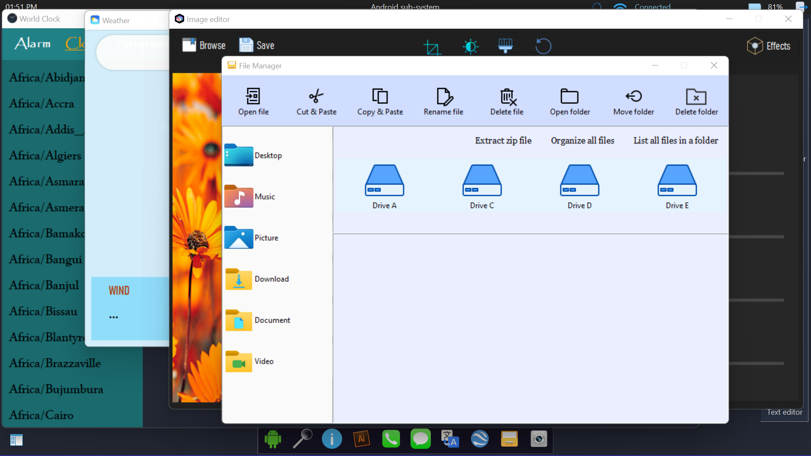

# Android-Subsystem-for-Windows
This is not an operating system but it looks like that. It provides you to all required apps which are important for an operating system like music player, video player, clock, pdf viewer, it's own browser, personal assistant, weather app, phone and messaging app and many more products. This is a learning based and also a big project to develop your python skill. It will provide a batter experience of user so that they feel such like an operating system.

Objective

The main focus of Android Subsystem is to provide a local sub-system as a software so that any person can use it in a very low cost computer and complete their work.

HOME SCREEN

ALL WIDGETS

Apps

Wireless adaptor options

Task bar

Android menu

Side widget

